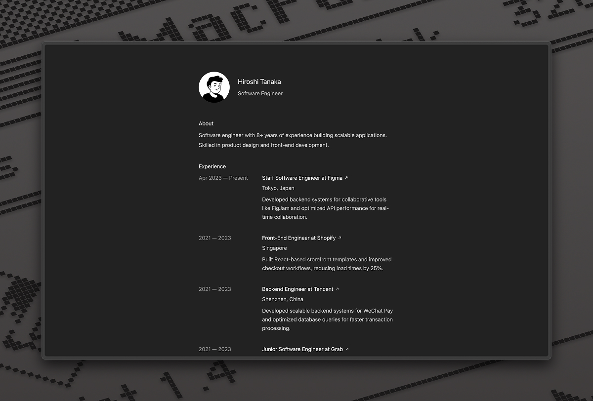

# read.cv Clone

A simple, modern personal website template inspired by [read.cv](https://read.cv). Easily copy, customize, and reuse for your own portfolio or resume site.

- Built with [Tailwind CSS](https://tailwindcss.com) for fast, responsive design
- Clean, minimal, and easy to edit
- No build tools required—just edit the HTML and go!

## Usage

1. Clone or download this repository
2. Replace the content and images with your own
3. Deploy anywhere (GitHub Pages, Vercel, Netlify, etc.)

Feel free to fork and make it your own! 

---

## Changelog 
2025-07-05: added simple hover effect on the links. 
